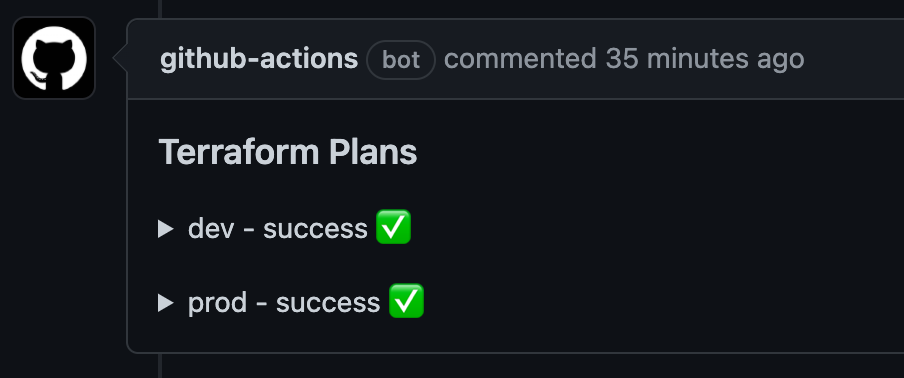

# Terraform Workflows

## Plan
The [terraform_plan](../.github/workflows/terraform_plan.yml) workflow validates terraform files and posts a comment showing any expected changes. Use this on pull requests. 



## Apply
The [terraform_apply](../.github/workflows/terraform_apply.yml) workflow runs `terraform apply` for each provided configuration. Use this on pushes to the default branch.

## Inputs
The `terraform_plan` and `terraform_apply` workflows share the same parameters and secrets.


| Parameter | Description | Type | Default |
| --------- | ----------- | ---- | ------- |
| terraform_root | Directory containing all other terraform folders. Used to shorten the paths provided in `directories` | string | "." |  
| directories | JSON string list of all directories containing terraform files, relative to `terraform_root` | string | "." |

| Secret | Description | Type |
| --------- | ----------- | ---- |
| aws-access-key-id | AWS Access Key for the IAM user performing Terraform updates | string |
| aws-secret-access-key | AWS Secret Access Key for the IAM user performing Terraform updates | string |


## Examples
Basic usage, all terraform files are in root folder of git repository.

```
name: Terraform Plan

on:
  pull_request:

jobs:
  plan:
    name: Plan
    uses: OneShop-Inc/github-workflows/.github/workflows/terraform_plan.yml@v1.0.1
    secrets:
      aws-access-key-id: ${{ secrets.AWS_ACCESS_KEY_ID }}
      aws-secret-access-key: ${{ secrets.AWS_SECRET_ACCESS_KEY }}
```

Multiple terraform configurations in `dev/` and `prod/`. Note how `directories` must be a string, not a list.
```
name: Terraform Plan

on:
  pull_request:

jobs:
  plan:
    name: Plan
    uses: OneShop-Inc/github-workflows/.github/workflows/terraform_plan.yml@v1.0.1
    with:
      directories: '["dev", "prod"]'
    secrets:
      aws-access-key-id: ${{ secrets.AWS_ACCESS_KEY_ID }}
      aws-secret-access-key: ${{ secrets.AWS_SECRET_ACCESS_KEY }}
```

Multiple terraform configurations in `environments/dev` and `environments/prod`. Using `terraform_root` shortens the values provided to `directories` and also makes the PR comment clearer.
```
name: Terraform Plan

on:
  pull_request:

jobs:
  plan:
    name: Plan
    uses: OneShop-Inc/github-workflows/.github/workflows/terraform_plan.yml@v1.0.1      
    with:
      terraform_root: environments
      directories: '["dev", "prod"]'
    secrets:
      aws-access-key-id: ${{ secrets.AWS_ACCESS_KEY_ID }}
      aws-secret-access-key: ${{ secrets.AWS_SECRET_ACCESS_KEY }}
```

Calling the `terraform_apply` workflow on pushes to the `main` branch
```
name: Terraform Apply

on:
  push:
    branches: [main]

jobs:
  apply:
    name: Apply
    uses: OneShop-Inc/github-workflows/.github/workflows/terraform_apply.yml@v1.0.0
    with:
      terraform_root: environments
      directories: '["dev", "prod"]'
    secrets:
      aws-access-key-id: ${{ secrets.AWS_ACCESS_KEY_ID }}
      aws-secret-access-key: ${{ secrets.AWS_SECRET_ACCESS_KEY }}
```
